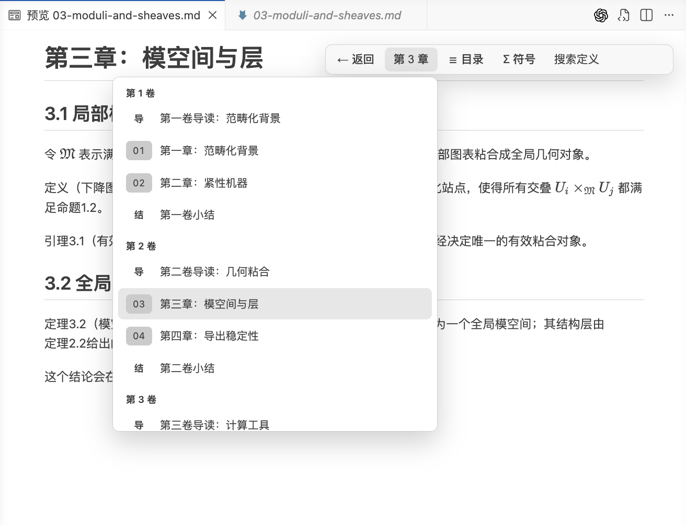
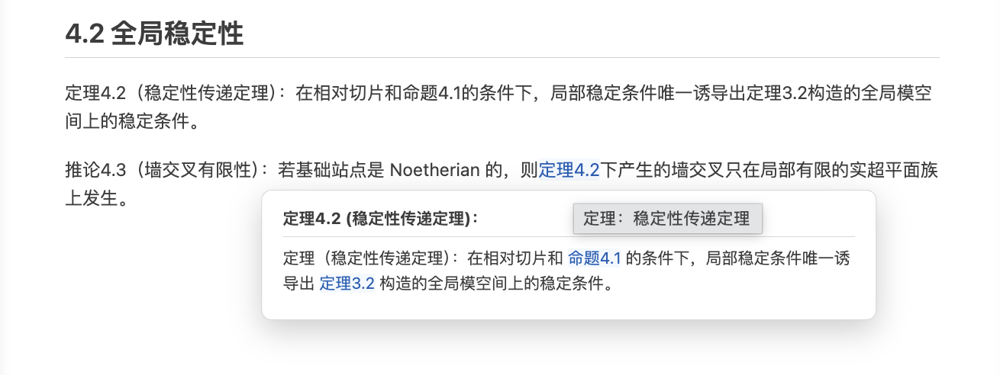

# math-workspace

[🌍 English](#en) | [🇨🇳 中文](#zh-cn)

---

<a name="en"></a>

## 🌍 English


`math-workspace` is a local Math Workspace service and CLI for long-form mathematical and technical writing. It can run beside Codex or in any browser side panel.

The current release also builds stable anchor indexes for configured Lean projects, while keeping anchor presence distinct from claims of complete formalization.

It keeps stable hash IDs in source Markdown, then renders human-facing numbering, references, navigation, definition lookup, symbol tables, dependency graphs, and publication exports from generated metadata.

The design target is AI-assisted editing:

- AI writes lightweight `tmp-*` markers while drafting.
- The CLI finalizes those markers into stable `h-*` IDs.
- Verification catches broken references, stale temporary IDs, and migration residue.

### Main Capabilities

- Stable numbering for pages, sections, theorem-like blocks, equations, figures, and tables.
- `@h-...` references that survive insertion, deletion, and chapter reordering.
- Definition lookup without forcing definitions into the numbering system, including deliberately named concept and glossary appendices.
- Current-page symbol table for project-specific LaTeX notation.
- Explicit dependency graph for theorem-like objects and proof-backed hash remarks, built from `@h-...` references.
- Stable-hash scanning from Lean docstrings, with anchor indexes, coverage reports, reviewed Markdown/declaration baselines, build records, direct dependency comparison, and light Lean badges in the reader and proposition map.
- Markdown and PDF export with title page, publication metadata page, and front matter pages.
- Reviewed AI workflow artifacts in `skills/`, plus VASMC catalog exports for lockable reuse.

### Local Math Workspace

```bash
npm run workspace -- serve /path/to/writing-project
```

The Math Workspace listens only on `127.0.0.1` and never writes manuscript source. Open the printed URL in Codex's local browser side panel or a normal browser for chapter navigation, a table of contents, current-page symbols, definition search, in-text explicit dependency markers, Lean anchor badges, recall, and live source refresh. Multi-volume projects naturally collapse to a volume-to-chapter navigation hierarchy. Clicking a Lean badge shows its anchored declarations, reviewed baseline, latest build, and direct dependency comparison; none of these states claims complete formalization or proof coverage.

Open the in-document **Marking tools** to choose selection, lasso, proposition, or erase. Marks remain as a soft highlight in the article; use the × at the top-right of a hovered highlight or the eraser to remove one. A mark stores only a project-local Markdown location, optional formal/formula anchor, and source hash—it never copies the manuscript or creates a second conversation. Then discuss it directly in a native Codex task: Codex can call `math_workspace_discussion_marks_get` for the active locators and read the corresponding source itself.

The repository also ships a Codex MCP plugin. It starts or reuses the local Math Workspace and provides narrow selection, formal-object, strict-dependency, Lean-alignment, and read-only validation queries. It does not embed the frontend or duplicate a Codex discussion layer:

```bash
math-workspace mcp
```

After installation, Codex can call `math_workspace` for the current prepared project or a named chapter. When the user refers to marked material, `math_workspace_discussion_marks_get` returns the active source locators; formal, dependency, Lean, and validation tools provide further focused context. With no available project, it opens the local project launcher. During development, make `math-workspace` available on `PATH`, for example with `npm link`.





Inline `@h-...` references render as current reader-facing numbers and support on-demand recall while preserving readable mathematical Markdown and LaTeX.

### Development Install

Install dependencies and build:

```bash
npm install
npm run build
```

Run the primary interface:

```bash
npm run workspace -- serve /path/to/writing-project
```

### Use In A Writing Project

A writing project vendors the CLI and owns its `.math-workspace/` metadata:

```text
tools/math-workspace/
  out/cli/math-workspace.js

.math-workspace/
  config.json
  definitions.json
  symbols.json
  project-analysis.md
```

Add a project script:

```json
{
  "scripts": {
    'workspace': "node tools/math-workspace/out/cli/math-workspace.js"
  }
}
```

Prepare the project:

```bash
npm run workspace -- prepare
```

After editing a file or directory:

```bash
npm run workspace -- finish path/to/chapter-or-dir
```

`finish` already runs validation. Run this separately only after direct `finalize`, a migration, or when an independent release gate is required:

```bash
npm run workspace -- verify
```

The Math Workspace requires `.math-workspace/config.json`, which `prepare` creates. It scans the current project state in memory; `workspace-index.json` is an inspectable structural snapshot, not a Math Workspace runtime prerequisite.

Install the CLI from npm:

```bash
npm install -D math-workspace
```

```json
{
  "scripts": {
    'workspace': "math-workspace"
  }
}
```

### AI Artifacts

`math-workspace` does not provide a remote auto-installed skill. AI integrations should read the reviewed artifacts that ship with the release bundle or npm package:

- Plain AI / ordinary projects: read `skills/editor.md` and `skills/integrator.md`; for Lean projects, also read `skills/lean-formalization.md`, then merge the rules into the target project's native instructions.
- VASMC projects: lock the `editor`, `integrator`, and optional `lean-formalization` exports from `vasm-catalog/vasmc-catalog.yaml`.
- npm projects: use `node_modules/math-workspace/skills/` and `node_modules/math-workspace/vasm-catalog/`.

The CLI can print paths for the current installation:

```bash
npm run workspace -- paths
```

### Minimal Syntax

Use stable IDs where hand-written numbers would normally appear:

```markdown
# #tmp-1 Basic Topology

## #tmp-2 Compactness

Theorem #tmp-3 (Finite Subcover Criterion): Let \(X\) be a compact space.

Proof: ...

By @tmp-3, every open cover has a finite subcover.
```

Rules:

- `#h-...` and `#tmp-*` are declarations only.
- Prose references use `@h-...`, `@h-....title`, or `@h-....full`.
- New declarations use `tmp-1`, `tmp-2`, and so on; `finish` replaces them.
- Definitions do not get hash IDs. Standard `Definition (Term): ...` / `定义（术语）：...` entries and deliberately named concept/glossary appendices are scanned automatically.
- `.math-workspace/project-analysis.md` is generated project knowledge context, not a hand-maintained source; Math Workspace rebuilds it in memory as content changes.
- AI maintains `.math-workspace/definitions.json` only for exceptions.
- Only project-specific notation with an explicit semantic change goes into `.math-workspace/symbols.json`.

### Documentation

Public documentation sources live in `docs-src/**/*.vasm.md` and are maintained Chinese-first.
Target-project AI skill sources live in `skills-src/**/*.vasm.md`. Generated outputs are
`README.md`, `docs/*.md`, `skills/*.md`, and `vasm-catalog/`. Lockable artifacts for external VASMC consumers are generated from `vasmc-build.yaml` catalog exports.

After changing documentation or skill sources, run:

```bash
npm run content:build -- --dry-run
npm run content:build
```

`--plan` is an alias for `--dry-run`; both only inspect the plan and do not write generated outputs, build-state, or the default report.
For single-file expansion, use `vasmc expand <source> --target-lang zh-CN`; it does not use workspace routing.
Before committing, run `npm run content:build`, read `.vasmc/build-report.yaml`, complete translate or review actions, and commit the generated Markdown.

- [docs/usage.md](docs/usage.md): syntax, commands, project structure, configuration, and PDF export.
- [docs/release.md](docs/release.md): release bundle structure and publishing checks.
- [skills/editor.md](skills/editor.md): detailed AI writing rules.
- [skills/integrator.md](skills/integrator.md): AI composition guidance artifact.
- [skills/lean-formalization.md](skills/lean-formalization.md): Lean anchoring and validation rules.

### Release

Build and verify:

```bash
npm test
npm run release:local
npm run release:check
```

Release output:

```text
dist/
  cli/
  skills/
  vasm-catalog/
  docs/
  README.md
  LICENSE
  INSTALL.md
  manifest.json
  checksums.txt
```

`cli/` contains the vendorable CLI and Math Workspace assets; the npm package installs the `math-workspace` CLI. Use `skills/` as reviewed AI workflow artifacts. When consuming through VASMC, prefer `vasm-catalog/vasmc-catalog.yaml` so the consumer lockfile fixes artifact hashes.

Release orchestration:

```bash
npm run release -- --dry-run
npm run release -- --only github,npm
npm run release:github
npm run release:gitlab
npm run release:npm
```

`release:local` only builds `dist/`; `release:check` is the pre-publish gate; `release` orchestrates mixed GitHub/GitLab/npm publishing.

### Checks

```bash
npm test
```

```bash
npm run workspace -- perf-dummy 50 200 --max-ms 2000 --max-heap-mb 256
```

```bash
npm audit --registry=https://registry.npmjs.org --omit=optional
```

The Math Workspace and CLI outputs remain dependency-free after bundling. Development dependencies are pinned for TypeScript, Vite bundling, and Markdown/LaTeX rendering.

---

<a name="zh-cn"></a>

## 🇨🇳 中文


Math Workspace 是一个本地数学工作区，用于长期维护数学或技术类书稿，并将写作、形式化锚点、审阅和项目导航放在同一个界面中。它可与 Codex 或任意浏览器侧栏并行运行。

`math-workspace` 是 Math Workspace 当前稳定的 Markdown 引擎和 CLI：包名、命令名与 `.math-workspace/` 项目配置保持兼容。工作区的范围面向数学写作、形式化与审阅的完整工作流；除 Markdown 与本地 Math Workspace 外，当前版本也可为配置的 Lean 项目建立稳定锚点索引。

它让源码保存稳定的 hash ID，再由工具渲染面向读者的编号、引用、导航、定义查询、符号表、依赖图和发布产物。

这个项目面向 AI 辅助写作：

- AI 写作时只需要使用轻量的 `tmp-*` 占位。
- CLI 会把临时 ID 固化为稳定的 `h-*` hash。
- 校验工具会检查断裂引用、残留临时 ID 和迁移遗留问题。

### 当前能力

- 章节、页面、小节、命题类对象、公式、图、表的稳定编号。
- `@h-...` 引用可承受插入、删除和章节重排。
- 定义查询不侵入编号系统，并能利用明确命名的概念/术语附录。
- 当前页符号表用于展示项目特有 LaTeX 记号。
- 从显式 `@h-...` 引用生成主线命题与带 hash 补充注释的依赖图。
- 从 Lean docstring 扫描稳定 hash，生成锚点索引、覆盖报告、正文/声明审阅基线、构建记录和直接依赖比对，并在正文和命题图中显示轻量 Lean 锚点徽章。
- Markdown/PDF 导出，支持封面、出版元数据页和前置声明页。
- `skills/` 提供给目标项目 AI 指令融合的规则 artifact；`vasm-catalog/` 提供可由 VASMC 锁定消费的 catalog exports。

### Math Workspace

运行工作区：

```bash
npm run workspace -- serve /path/to/writing-project
```

Math Workspace 只监听 `127.0.0.1`，不写入书稿源码。打开命令打印的 URL 后，可获得章节导航、目录、当前页符号表、定义搜索、命题类对象和带 hash 补充注释旁的显式依赖标记、Lean 锚点徽章、引用回溯和源文件实时刷新。多卷结构会自然折叠成卷到章的导航层级。点击正文中的 Lean 徽章可查看锚定声明、审阅基线、最近构建与直接依赖比对；它们都只反映可审计的工程状态，不表示完整形式化或证明覆盖。

正文中的“标记工具”提供选区、圈选、整条命题与擦除四种方式。已标记内容直接以柔和底色显示，悬停右上角可单独移除；选区、圈选与命题选择可并行保留。标记只保存项目内的 Markdown 文件与行号、formal/公式锚点和来源 hash，不复制正文，也不创建第二套会话。随后在原生 Codex 任务中直接开始讨论；Codex 可调用 `math_workspace_discussion_marks_get` 读取当前标记的定位，再自行读取对应源码。

仓库也提供 Codex MCP plugin。它可启动或复用本地 Math Workspace，并提供讨论标记、命题、严格依赖、Lean 对齐和只读校验查询；不嵌入或复制工作区前端，更不维护另一套 Codex 对话逻辑：

```bash
math-workspace mcp
```

安装 plugin 后，Codex 可以调用 `math_workspace` 打开当前 prepared project 或指定章节；当用户提及“标记的材料”或“这段内容”时，可调用 `math_workspace_discussion_marks_get` 获得当前讨论标记的源码定位，并结合命题、依赖、Lean 和校验工具完成工作。没有绑定项目时则显示本机项目启动台。开发使用 `npm link` 时，确保 `math-workspace` 在 `PATH` 中即可。


正文里的 `@h-...` 引用会渲染为当前编号，并支持按需 recall，保留数学 Markdown 和 LaTeX 的可读性。

### 本地开发安装

安装依赖并构建：

```bash
npm install
npm run build
```

启动 Math Workspace：

```bash
npm run workspace -- serve /path/to/writing-project
```

### 在写作项目中使用

目标项目通常 vendoring CLI，并自己维护 `.math-workspace/` 数据：

```text
tools/math-workspace/
  out/cli/math-workspace.js

.math-workspace/
  config.json
  definitions.json
  symbols.json
  project-analysis.md
```

添加项目脚本：

```json
{
  "scripts": {
    'workspace': "node tools/math-workspace/out/cli/math-workspace.js"
  }
}
```

开始前生成索引：

```bash
npm run workspace -- prepare
```

编辑文件或目录后固化 ID 并刷新缓存：

```bash
npm run workspace -- finish path/to/chapter-or-dir
```

`finish` 已执行校验。只有直接使用 `finalize`、执行迁移，或需要独立 release 门禁时，再运行：

```bash
npm run workspace -- verify
```

Math Workspace 需要项目根目录存在 `.math-workspace/config.json`，可由 `prepare` 创建。它每次在内存中扫描当前状态；`workspace-index.json` 仅是可检查的结构化快照，不是 Math Workspace 的运行时前提。

如果通过 npm 使用 CLI：

```bash
npm install -D math-workspace
```

```json
{
  "scripts": {
    'workspace': "math-workspace"
  }
}
```

### AI artifacts

`math-workspace` 不提供自动安装的远端 skill。AI 接入时只读 release 或 npm 包里的可审阅 artifact：

- 裸 AI / 普通项目：读取 `skills/editor.md`、`skills/integrator.md`；项目使用 Lean 时再读取 `skills/lean-formalization.md`，然后把规则融合进目标项目原生 `AGENTS.md`、写作 skill 或项目指南。
- VASMC 项目：通过 `vasm-catalog/vasmc-catalog.yaml` 锁定 `editor`、`integrator` 和按需使用的 `lean-formalization` exports。
- npm 项目：对应路径是 `node_modules/math-workspace/skills/` 和 `node_modules/math-workspace/vasm-catalog/`。

CLI 可以打印当前安装位置：

```bash
npm run workspace -- paths
```

### 最小语法

把原本需要手写编号的位置替换成稳定 ID：

```markdown
# #tmp-1 基础拓扑

## #tmp-2 紧性

定理 #tmp-3（有限子覆盖判据）：设 \(X\) 为紧空间。

证明：...

由 @tmp-3 可知，每个开覆盖都有有限子覆盖。
```

规则：

- `#h-...` 和 `#tmp-*` 只用于声明位置。
- 正文引用使用 `@h-...`、`@h-....title` 或 `@h-....full`。
- 新增声明使用 `tmp-1`、`tmp-2` 等；`finish` 会替换为正式 hash。
- 定义不加 hash。标准 `定义（术语）：...` / `Definition (Term): ...`，以及明确命名的概念/术语附录，会由工具自动扫描。
- `.math-workspace/project-analysis.md` 是生成的知识页摘要，不是手工源；Math Workspace 会随内容变化在内存中重建它。
- AI 只为例外定义维护 `.math-workspace/definitions.json`。
- 只有发生显式语义变化的项目特有符号约定进入 `.math-workspace/symbols.json`。

### 文档入口

公开文档的维护源在 `docs-src/**/*.vasm.md`，采用中文优先维护。
目标项目 AI skill 的维护源在 `skills-src/**/*.vasm.md`。生成产物是
`README.md`、`docs/*.md`、`skills/*.md` 和 `vasm-catalog/`。对外给 VASMC 消费的可锁定 artifact 由 `vasmc-build.yaml` 的 `catalog.exports` 生成。

修改文档或 skill source 后运行：

```bash
npm run content:build -- --dry-run
npm run content:build
```

`--plan` 是 `--dry-run` 的别名；二者只查看计划，不写生成物、build-state 或默认 report。需要单文件展开时可用
`vasmc expand <source> --target-lang zh-CN`，它不走 workspace routing。
真正提交前再运行 `npm run content:build`，读取 `.vasmc/build-report.yaml`，
完成 translate 或 review action，再提交生成后的 Markdown。

- [docs/usage.md](docs/usage.md)：语法、命令、项目结构、配置和 PDF 导出。
- [docs/release.md](docs/release.md)：release 包结构和发布检查。
- [skills/editor.md](skills/editor.md)：详细 AI 写作规则。
- [skills/integrator.md](skills/integrator.md)：AI 组合指导 artifact。
- [skills/lean-formalization.md](skills/lean-formalization.md)：Lean 锚定与验证规则。

### Release

构建并验证：

```bash
npm test
npm run release:local
npm run release:check
```

生成产物：

```text
dist/
  cli/
  skills/
  vasm-catalog/
  docs/
  README.md
  LICENSE
  INSTALL.md
  manifest.json
  checksums.txt
```

`cli/` 包含目标项目本地 vendoring 所需的 CLI 和 Math Workspace 静态资源，npm 包用于安装 `math-workspace` CLI。`skills/` 包含需要审阅和融合的 AI artifact。通过 VASMC 接入时，优先使用 `vasm-catalog/vasmc-catalog.yaml` 并让 consumer lockfile 固定 hash。

发布编排：

```bash
npm run release -- --dry-run
npm run release -- --only github,npm
npm run release:github
npm run release:gitlab
npm run release:npm
```

`release:local` 只构建 `dist/`；`release:check` 是发布前门禁；`release` 负责 GitHub/GitLab/npm 的混合发布编排。

### 检查

```bash
npm test
```

```bash
npm run workspace -- perf-dummy 50 200 --max-ms 2000 --max-heap-mb 256
```

```bash
npm audit --registry=https://registry.npmjs.org --omit=optional
```

构建后的 Math Workspace 和 CLI 运行时保持无 npm 运行时依赖。开发依赖只用于 TypeScript、Vite 打包和 Markdown/LaTeX 渲染。
