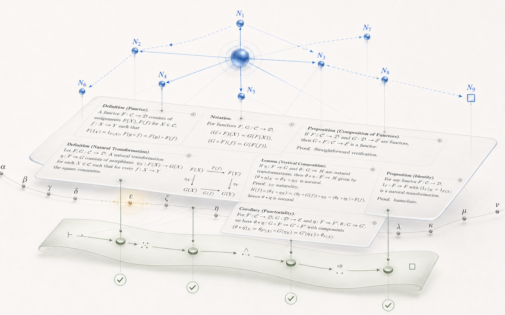
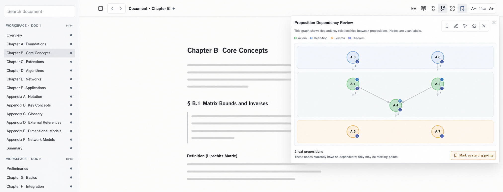
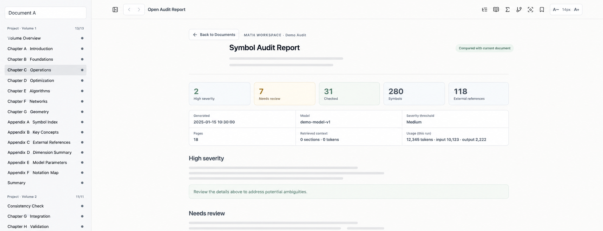

# math-workspace



[🌍 English](#en) | [🇨🇳 中文](#zh-cn)

---

<a name="en"></a>

## 🌍 English


Math Workspace is a local environment for long-form mathematical writing and formalization work. It keeps the manuscript in Markdown that remains readable to humans and AI, while organizing stable numbering, references, proposition dependencies, notation, Lean anchors, review, and publication into one inspectable workflow.

The current release uses Markdown as its manuscript source layer and `math-workspace` as both the package and CLI name, but the product scope is broader than Markdown. The Reader, Lean toolchain, and Codex MCP all serve the mathematical project itself: how the manuscript evolves, how propositions support one another, whether notation has drifted, and whether formal implementations remain aligned with the source.

Math Workspace does not prove mathematical claims for you or silently rewrite a manuscript in the background. Deterministic scans and validation own what can be checked mechanically. Model-assisted features must be started explicitly, and their output is review advice rather than a source of truth.

### Quick Start

Install it in a mathematical writing project:

```bash
npm install -D math-workspace
npx math-workspace prepare
npx math-workspace serve .
```

`prepare` creates or completes `.math-workspace/config.json` and generates inspectable project indexes. `serve` starts a local Reader bound only to `127.0.0.1`. After editing a chapter, use `finish` to finalize temporary anchors and run validation:

```bash
npx math-workspace finish path/to/chapter.md
```

You can also keep a stable project script:

```json
{
  "scripts": {
    "workspace": "math-workspace"
  }
}
```

```bash
npm run workspace -- prepare
npm run workspace -- serve .
npm run workspace -- finish path/to/chapter.md
```

### The Problem It Solves

A large mathematical project rarely needs only another Markdown preview. What becomes difficult after dozens of chapters and hundreds of propositions is the structure:

- Handwritten numbering and prose references drift when chapters are inserted, deleted, or reordered.
- Strict prerequisites, downstream use, and propositions with no downstream consumers are hard to inspect as a whole.
- Dedicated and temporary notation can acquire conflicting meanings during long revision cycles.
- Lean declarations may exist without stable manuscript anchors, build evidence, or dependency comparison.
- Copying large passages into an AI discussion creates redundant context and a second conversation history.

Math Workspace approaches these problems source-first. Stable identity stays in source, the Reader interprets and organizes it, and every review result leads back to a concrete file, line range, or `h-*` anchor.

### Workspace Capabilities

#### Stable Identity and References

Pages, sections, theorem-like objects, equations, figures, and tables use stable hashes while reader-facing numbers are derived from the current structure. `@h-...` references survive insertion, deletion, and chapter reordering. `finish` turns `tmp-*` placeholders written by an author or AI into permanent identities, while `verify` checks broken references, temporary-ID residue, and migration leftovers.

Definitions and symbols remain separate lookup systems; indexing them does not make them theorem-numbering objects. Deliberately named concept, terminology, and notation appendices can be used as project knowledge sources.

#### Local Reader

The Reader is the primary supported interface. It provides:

- Multi-volume chapter navigation, contents, definition lookup, current-page symbols, and reference recall.
- Strict dependency markers for theorem-like objects, chapter relationship graphs, endpoint review, and assisted batch review.
- Integration status that distinguishes content already managed with stable anchors from material still awaiting migration.
- Live source refresh and a compact layout suitable for a browser side panel.

The Reader reads project source but does not directly write the manuscript. Its enhanced interface is enabled only for projects containing `.math-workspace/config.json`.



#### Symbol Audit

Symbol audit looks for identical notation with different meanings and for reuse that may confuse readers. It never runs silently:

1. The user chooses the whole project, one volume, or selected chapters, then chooses a Codex model and reasoning effort.
2. The model extracts dedicated and temporary symbol bindings, including structure, scope, and meaning.
3. Local logic produces same-shape candidates; semantic reconciliation then distinguishes the same binding, specialization, compatible reuse, conflict, and uncertainty.
4. Only high-confidence conflicts involving at least one dedicated symbol enter the hard-conflict list. Everything else remains for human review.

Extractions are cached by file-content hash, model, and prompt version, so unchanged chapters are not extracted again. The interface reports activity, model calls, and token usage when Codex exposes it. Results open as a standalone report with rendered LaTeX. Audit findings remain advisory: they never enter the `verify` gate and never rename a symbol automatically.



#### Lean Alignment

Once Lean projects are configured, Math Workspace scans stable manuscript anchors from declaration docstrings and provides:

- Anchor indexes and coverage-candidate reports.
- Reviewed manuscript–declaration contract baselines.
- Recorded Lake build results.
- Comparison between direct Lean declaration dependencies and strict manuscript dependencies.
- Lightweight `L` marks in the Reader and proposition graph.

This evidence means that an anchor exists, a baseline was reviewed, a build passed, or a dependency was observed. It does not establish semantic equivalence, complete formalization, or 100% proof coverage.

#### Codex Collaboration

The in-document marking tools support text selection, lasso, whole-proposition selection, and erasing. A mark stores only a project-local Markdown location, any available formal or equation anchor, and a source hash. It does not copy the manuscript or create another chat.

When the discussion continues in a native Codex task, MCP can return those locators and Codex can read the corresponding source. The repository exposes these read-only tools:

- `math_workspace_discussion_marks_get` returns deliberate, active marks.
- `math_workspace_formal_lookup` looks up one formal object by stable ID.
- `math_workspace_dependency_slice` returns a bounded strict upstream/downstream slice.
- `math_workspace_lean_alignment` returns Lean anchor, build, and dependency evidence.
- `math_workspace_verify` performs an in-memory, read-only validation scan.
- `math_workspace` starts or reuses the local Reader.

```bash
math-workspace mcp
```

Real discussion, edits, and approvals therefore remain in native Codex task history; Math Workspace supplies project structure and precise source locations. It currently does not attempt to inject Reader messages into native Codex conversations.

#### Publication

Stable source anchors do not leak into reader-facing numbering. Export commands generate publication-ready Markdown or call local Pandoc and LaTeX tooling to produce PDF:

```bash
math-workspace export-md book/ --out dist/book.md
math-workspace export-md-split book/ --out dist/public
math-workspace export-pdf book/ --out dist/book.pdf
```

The PDF workflow supports covers, publication metadata, front matter, a table of contents, and project-level layout settings. Math Workspace does not bundle Pandoc or a LaTeX engine.

### The VS Code Extension Is Retired

The former VS Code preview extension is frozen under `legacy/vscode-extension/` only for understanding older projects and historical implementation:

- It is excluded from current builds, tests, packages, and releases.
- It receives no new capabilities, compatibility fixes, or product support.
- It should not be copied into a new editor installation.

The local Reader now owns navigation, recall, lookup, proposition review, Lean alignment, symbol audit, and Codex context marking. If you must reproduce the old VS Code workflow, pin the last repository revision that supported it.

### Minimal Syntax

Start new structure with temporary identities:

```markdown
# #tmp-1 Basic Topology

## #tmp-2 Compactness

Theorem #tmp-3 (Finite Subcover Criterion): Let \(X\) be compact.

Proof: ...

By @tmp-3, every open cover has a finite subcover.
```

Then run:

```bash
math-workspace finish path/to/chapter.md
```

Basic rules:

- `#h-...` and `#tmp-*` only declare object identity.
- Prose references use `@h-...`, `@h-....title`, or `@h-....full`.
- New objects use `tmp-1`, `tmp-2`, and so on; never manufacture permanent hashes by hand.
- Definitions do not receive hashes. Standard `Definition (Term): ...` / `定义（术语）：...` entries are scanned by the lookup system.
- Only project-specific notation with an explicit semantic change belongs in `.math-workspace/symbols.json`; symbol audit separately observes temporary bindings in manuscript prose.

See [docs/usage.md](docs/usage.md) for complete syntax, migrations, graph queries, configuration, and PDF options.

### Project Data and Trust Boundary

Each target project owns its configuration and generated metadata:

```text
.math-workspace/
  config.json
  definitions.json
  symbols.json
  project-analysis.json
  project-analysis.md
  workspace-index.json
  reference-map.md
  report.md
```

`workspace-index.json` is an inspectable structural snapshot, not the Reader's runtime database; the Reader rebuilds state in memory from current source. Discussion marks, recent projects, and symbol-audit caches are local user state and are not written into the manuscript.

Deterministic commands own identity, references, scanning, and validation. Model-backed features such as symbol audit and assisted quick review call Codex only after explicit user action and remain cancellable, cacheable, and non-authoritative.

### AI and Skill Artifacts

The release and npm package ship reviewable AI artifacts:

- `skills/editor.md` contains target-project writing rules.
- `skills/integrator.md` explains how to merge those rules into existing project constraints.
- `skills/lean-formalization.md` defines Lean anchoring, implementation, and validation rules.
- `vasm-catalog/vasmc-catalog.yaml` provides exports whose hashes can be locked by a VASMC lockfile.

These rules are never installed or updated remotely without review. A target project should inspect them first, then merge them into its own `AGENTS.md`, skill, or project guide.

### Development

```bash
git clone git@github.com:glenzli/math-workspace.git
cd math-workspace
npm install
npm run build
npm test
```

Use `npm link` for local CLI and Codex plugin development. Public documentation sources live under `docs-src/**/*.vasm.md`. After editing them, run:

```bash
npm run content:build -- --dry-run
npm run content:build
```

See [docs/release.md](docs/release.md) for publishing. Common checks:

```bash
npm run release:local
npm run release:check
npm audit --registry=https://registry.npmjs.org --omit=optional
```

Bundled CLI and Reader output has no npm runtime dependencies. Development dependencies cover TypeScript, Vite, Markdown, and LaTeX rendering.

### Repositories

- [GitHub](https://github.com/glenzli/math-workspace)
- [GitLab](https://gitlab.com/glenzli/math-workspace)

MIT License.

---

<a name="zh-cn"></a>

## 🇨🇳 中文


Math Workspace 是一个面向长篇数学写作与形式化协作的本地工作区。它让正文保持适合人和 AI 阅读的 Markdown，同时把稳定编号、引用、命题依赖、符号使用、Lean 锚点、审阅与发布组织成一套可检查的工作流。

当前版本以 Markdown 作为书稿源层，以 `math-workspace` 作为包名和 CLI 名称；产品边界并不止于 Markdown。Reader、Lean 工具链和 Codex MCP 共同面向的是数学项目本身：正文如何演化、命题如何相互支撑、符号是否漂移、形式化实现与原文是否仍然对齐。

Math Workspace 不会替你证明数学结论，也不会在后台悄悄改写书稿。确定性的扫描与校验负责可以机械判断的部分；模型辅助能力必须由用户显式启动，其结果作为审阅意见而不是事实来源。

## 快速开始

在数学项目中安装：

```bash
npm install -D math-workspace
npx math-workspace prepare
npx math-workspace serve .
```

`prepare` 会创建或补全 `.math-workspace/config.json` 并生成可检查的项目索引；`serve` 启动只监听 `127.0.0.1` 的本地 Reader。编辑一章后，用 `finish` 固化临时锚点并完成校验：

```bash
npx math-workspace finish path/to/chapter.md
```

也可以在目标项目中保留一个稳定脚本：

```json
{
  "scripts": {
    "workspace": "math-workspace"
  }
}
```

```bash
npm run workspace -- prepare
npm run workspace -- serve .
npm run workspace -- finish path/to/chapter.md
```

## 它解决什么问题

大型数学项目很少只缺一个 Markdown 预览器。真正容易失控的是跨越数十章、数百个命题之后的结构：

- 插入、删除或重排章节后，手写编号和正文引用开始漂移。
- 一个命题的严格前提、后续用途与无下游端点难以整体观察。
- 专用符号与临时符号在长期修订中可能发生语义冲突。
- Lean 声明虽然存在，却缺少稳定的正文锚点、构建证据与依赖对照。
- 与 AI 讨论时，复制大段正文会制造额外上下文和第二套会话历史。

Math Workspace 采用 source-first 的方式处理这些问题：稳定身份保存在源码中，Reader 只负责解释和组织，所有审阅结果都能回到具体文件、行号或 `h-*` 锚点。

## 工作区能力

### 稳定身份与引用

章节、小节、命题类对象、公式、图和表使用稳定 hash，而读者看到的编号由当前结构生成。`@h-...` 引用可以承受插入、删除和章节重排；`finish` 将 AI 或作者写下的 `tmp-*` 占位符固化为正式身份，`verify` 检查断裂引用、残留临时 ID 和迁移遗留问题。

定义和符号保持为独立的查询系统，不会因为进入索引而自动参与命题编号。明确命名的概念、术语与符号附录可以作为项目知识来源。

### 本地 Reader

Reader 是当前受支持的主要界面，提供：

- 多卷到章节的导航、目录、定义查询、当前页符号和引用回溯。
- 命题类对象的严格依赖标记、章节关系图、端点审阅与批量辅助审阅。
- 内容接管状态，用于区分已经使用稳定锚点管理的章节与仍待迁移的内容。
- 正文实时刷新，以及适合浏览器侧栏的紧凑阅读布局。

Reader 只读取项目源码，不直接写入书稿。增强界面只会在存在 `.math-workspace/config.json` 的项目中启用。


### 符号审计

符号审计用于发现“同形但不同义”以及可能造成阅读混淆的复用。它不会静默运行：

1. 用户选择全部、单卷或若干章节，并指定 Codex 模型与推理强度。
2. 模型提取专用符号和临时符号的结构、作用域与意义。
3. 本地逻辑生成同形候选，再由语义复核区分同一绑定、特化、兼容复用、冲突与不确定项。
4. 只有高置信、涉及专用符号且被复核为冲突的项目进入硬冲突；其余进入人工审阅。

提取结果按文件内容 hash、模型与提示版本缓存；未变化的章节不会重复提取。运行状态、模型调用和可获得的 token 用量会在界面中反馈，结果可以在独立报告中用 LaTeX 正常阅读。审计结果始终是辅助意见，不会进入 `verify` 门禁，也不会自动修改符号。


### Lean 对齐

配置 Lean 项目后，Math Workspace 从声明 docstring 扫描稳定正文锚点，并提供：

- 锚点索引与覆盖候选报告。
- 已审阅的正文—声明契约基线。
- 可记录的 Lake 构建结果。
- Lean 声明直接依赖与正文严格依赖的对照。
- Reader 正文与命题图中的轻量 `L` 标记。

这些证据说明“存在锚点、曾经审阅、构建通过或观察到某些依赖”，不表示语义等价、完整形式化或百分之百证明覆盖。

### Codex 协作

正文标记工具支持普通选区、圈选、整条命题和擦除。一个标记只保存项目内的 Markdown 位置、可用的 formal/公式锚点和来源 hash，不复制正文，也不创建另一套聊天。

在原生 Codex 任务中讨论时，MCP 可以读取这些定位，再由 Codex 打开对应源码。仓库提供的只读工具包括：

- `math_workspace_discussion_marks_get`：读取当前主动标记的位置。
- `math_workspace_formal_lookup`：按稳定 ID 查询一个 formal 对象。
- `math_workspace_dependency_slice`：读取有限深度的严格上下游。
- `math_workspace_lean_alignment`：查询 Lean 锚点、构建和依赖证据。
- `math_workspace_verify`：在内存中执行只读校验。
- `math_workspace`：启动或复用本地 Reader。

```bash
math-workspace mcp
```

这种设计让真实讨论、修改和审批继续留在 Codex 原生任务历史中；Math Workspace 只提供项目结构和精确位置。当前不会尝试从 Reader 向 Codex 原生会话注入消息。

### 发布

源码中的稳定锚点不会直接暴露为读者编号。导出命令会生成可发布的 Markdown，或调用本机 Pandoc 与 LaTeX 引擎生成 PDF：

```bash
math-workspace export-md book/ --out dist/book.md
math-workspace export-md-split book/ --out dist/public
math-workspace export-pdf book/ --out dist/book.pdf
```

PDF 流程支持封面、出版元数据页、前置声明、目录与项目级版式配置；Math Workspace 不捆绑 Pandoc 或 LaTeX 引擎。

## VS Code 扩展已经退役

早期的 VS Code 预览扩展已经冻结在 `legacy/vscode-extension/`，仅用于理解旧项目和历史实现：

- 不参与当前构建、测试、打包或发布。
- 不再获得新能力、兼容性修复或产品支持。
- 不建议复制到新的编辑器安装中。

本地 Reader 已经接管导航、引用回溯、查询、命题审阅、Lean 对齐、符号审计和 Codex 上下文标记。确实需要复现旧 VS Code 工作流时，请固定到最后支持它的历史仓库版本。

## 最小语法

新增结构时先使用临时身份：

```markdown
# #tmp-1 基础拓扑

## #tmp-2 紧性

定理 #tmp-3（有限子覆盖判据）：设 \(X\) 为紧空间。

证明：...

由 @tmp-3 可知，每个开覆盖都有有限子覆盖。
```

然后运行：

```bash
math-workspace finish path/to/chapter.md
```

基本规则：

- `#h-...` 和 `#tmp-*` 只声明对象身份。
- 正文引用使用 `@h-...`、`@h-....title` 或 `@h-....full`。
- 新对象使用 `tmp-1`、`tmp-2` 等；不要手工制造正式 hash。
- 定义不加 hash；标准 `定义（术语）：...` / `Definition (Term): ...` 由查询系统扫描。
- 只有发生显式语义变化的项目专用记号进入 `.math-workspace/symbols.json`；符号审计会另外观察正文中的临时绑定。

完整语法、迁移、图查询、配置和 PDF 选项见 [docs/usage.md](docs/usage.md)。

## 项目数据与信任边界

目标项目拥有自己的配置和生成元数据：

```text
.math-workspace/
  config.json
  definitions.json
  symbols.json
  project-analysis.json
  project-analysis.md
  workspace-index.json
  reference-map.md
  report.md
```

`workspace-index.json` 是可检查的结构快照，不是 Reader 的运行时数据库；Reader 会从当前源码在内存中重建状态。讨论标记、最近项目与符号审计缓存属于本机用户状态，不会写进书稿。

确定性命令负责身份、引用、扫描与校验。符号审计和辅助快审等模型能力只在用户明确触发时调用 Codex，并且保持可取消、可缓存和非权威。

## AI 与 Skill 产物

release 和 npm 包提供可审阅的 AI artifact：

- `skills/editor.md`：目标项目的写作规则。
- `skills/integrator.md`：把规则融合进既有项目约束的组合指南。
- `skills/lean-formalization.md`：Lean 锚定、实现和验证规则。
- `vasm-catalog/vasmc-catalog.yaml`：可由 VASMC lockfile 固定 hash 的 exports。

这些规则不会远程自动安装或更新。目标项目应先审阅，再融合进自己的 `AGENTS.md`、skill 或项目指南。

## 开发

```bash
git clone git@github.com:glenzli/math-workspace.git
cd math-workspace
npm install
npm run build
npm test
```

本机联调 CLI 与 Codex plugin 时可以使用 `npm link`。公开文档的维护源在 `docs-src/**/*.vasm.md`，修改后运行：

```bash
npm run content:build -- --dry-run
npm run content:build
```

发布说明见 [docs/release.md](docs/release.md)。常用检查：

```bash
npm run release:local
npm run release:check
npm audit --registry=https://registry.npmjs.org --omit=optional
```

构建后的 CLI 与 Reader 保持无 npm 运行时依赖；开发依赖用于 TypeScript、Vite、Markdown 与 LaTeX 渲染。

## 仓库

- [GitHub](https://github.com/glenzli/math-workspace)
- [GitLab](https://gitlab.com/glenzli/math-workspace)

MIT License。
